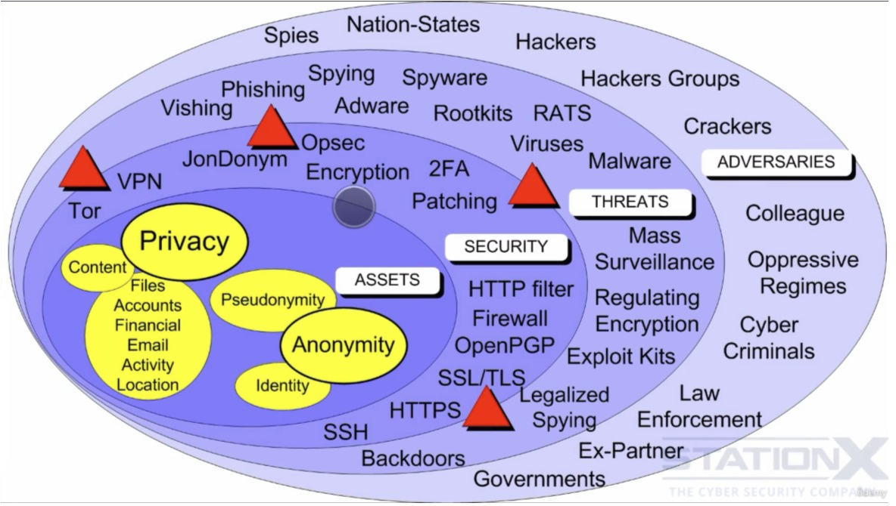

## Which VPN protocol is the best to use

**VPN Protocols**

- Point-to-Point Tunneling Protocol (PPTP)
  - Do not recommend, preinstall on windows
- Layer Two Tunneling Protocol (L2TP)
  - usually implemented with IPsec that provides encryption privacy
  - most modern OS support it
  - uses fixed ports and protocols
  - may require port forwarding
  - viable if you are not concerned about nation state advesaries
  - the same for IPsec
- Internet Protocol Security (IPsec)
  - can use preshared keys but are publicly available, implementation vulnerability
- OpenVPN
  - open source, uses open SSL library: supports lots of encryption algorithms (AES 256 recommended)
  - ports and protocols are configurable
  - disadvantage: not natively supported (needs 3rd party software)
  - use strong algortithms and ephemeral keys - session keys are periodically changed
    - 2048-bit or 4096-bit RSA certificates
    - DHE-RSA-AES256-SHA for exchange of OpenVPN key material
    - AES-256-CBC-SHA for data
- Secure Socket Tunneling Protocol (SSTP)
  - proprietary standard owned by Microsoft
- Internet Key Exchange (IKEv2)
  - IPSec based tunneling protocol
  - use case for mobile, because has enhanced ability to reconnect 
- SoftEther
- OpenConnect

**Conclusion**

1. OpenVPN
2. Internet Key Exchange (IKEv2)
3. Layer Two Tunneling Protocol (L2TP) / Internet Protocol Security (IPsec)
4. Point-to-Point Tunneling Protocol (PPTP)

---

## Email Tracking and Hacking

The way the emails are rendered, is an attack vector for both tracking you and hacking you.

The application renders a content of what is sent to you
- text
- html
- scripts
- tags
- images
- videos
- headers

That means that 3rd party elements can reach out of the email to contact email servers

Email can also attempt to hack you and inject malware through some vulnerability of the browser

Tool: emailprivacytester.com

**Benefits of an email client**

- can prevent what it parses
  - e.g. disable all remote content
- can render the email as text instead of html
- can prevent cookies

To mitigate email tracking & hacking should use
- compatamentalization
- sandboxing
- updates
- disabling functionalities
- anonymizing services
- disable automatic downloading

A browser may be more vulnerable for malwares, plus your advesary can take control of the web server hosting the web mail.

---

## Security Vulnerabilities, Threats and Advesaries

> Risk = (Vulnerabilities x Threats x Consequences)

**Security is**
- a technology
- an action
- a process

---

